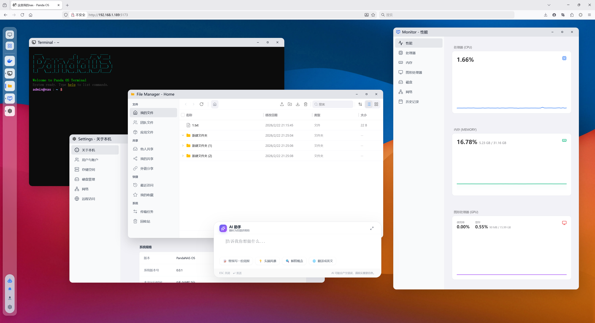

# Panda Home Station

[中文](README_zh.md)



**Panda Home Station** is a revolutionary system that unifies a Network Attached Storage (NAS) and a high-performance game console into a single, cohesive platform. Designed to be the ultimate **Home Data Center**, it is implemented entirely in **Rust** for maximum performance, safety, and reliability.

## Core Features

### 1. NAS Server & Web Desktop
A powerful storage solution featuring a modern, web-based desktop environment. At its heart is an embedded **AI Agent** system that intelligently manages your data and enhances your interaction with the platform.

### 2. JollyPad
A next-generation game console built from the ground up in Rust. JollyPad aims to deliver a console gaming experience comparable to the PS5, leveraging the efficiency and safety of Rust.

---

## Repository Management

This repository uses Google's `repo` tool to manage multiple Git projects.

### Initial Setup

1. Install `repo` tool (if not already installed):
   ```bash
   curl https://storage.googleapis.com/git-repo-downloads/repo > ~/.local/bin/repo
   chmod a+x ~/.local/bin/repo
   ```

2. Initialize the repo:
   ```bash
   git clone https://github.com/panda-home-station/phs.git
   cd phs
   repo init . -m repos/default.xml
   ```

3. Sync all repositories:
   ```bash
   repo sync
   ```

### Common Commands

- **Sync latest changes**: `repo sync`
- **Start a new branch**: `repo start <branch_name> --all`
- **Upload changes**: `repo upload`

## Development Guide

### 1. JollyPad (Game Console Interface)

JollyPad is a native interface developed in Rust and can be run directly via Cargo.

**Prerequisites:**
- Rust (Cargo)
- System Libraries: `libasound2-dev`, `libudev-dev`, `pkg-config` (Ubuntu/Debian examples)

**Build and Run:**
```bash
cd jollypad
cargo run --release --bin jolly-launcher
```

**Manual Game Configuration:**
Currently, JollyPad requires manual configuration for game paths. Please create an `.ini` configuration file in the `~/.jolly/app/` directory (e.g., `com.localhost.split.ini`) with the following content:

```ini
[Game]
Name=Split
Type=flatpak
Icon=/home/jolly/.jolly/app/split.png
Exec=/home/jolly/games/Split/Binaries/Win64/SplitFiction.exe
Terminal=false
Categories=Game

[Env]
PROTON_NO_ESYNC=1
PROTON_NO_FSYNC=1
WINEDLLOVERRIDES=socialclub=n;nvapi=d;nvapi64=d;winedbg=d;amd_ags_x64=b
PROTON_ENABLE_WAYLAND=0
SDL_VIDEODRIVER=x11
PROTON_ENABLE_NVAPI=0
PROTON_LOG=1
WINEDEBUG=fixme+all,err+all
Steam_Language=schinese
```

### 2. NAS (Web Server & Desktop)

The NAS component consists of a Rust backend (nasserver) and a React frontend (webdesktop).

**Prerequisites:**
- Rust (Cargo)
- Node.js (v18+) & npm
- PostgreSQL (requires creating a `pnas_db` database)
- System Libraries: `libfuse3-dev`, `pkg-config`, `libssl-dev`

**One-Click Start (Recommended):**
The project provides a development script to start both backend and frontend services simultaneously:

```bash
# 1. Ensure PostgreSQL is running and the database is created
# Default connection URL: postgres://postgres@localhost/pnas_db or using peer auth
createdb pnas_db

# 2. Run the development script
./nas/scripts/run_dev.sh
```

The script will automatically:
- Start the Rust backend (port 8000)
- Start the Web frontend (port 5173)
- Handle file system mount cleanup
