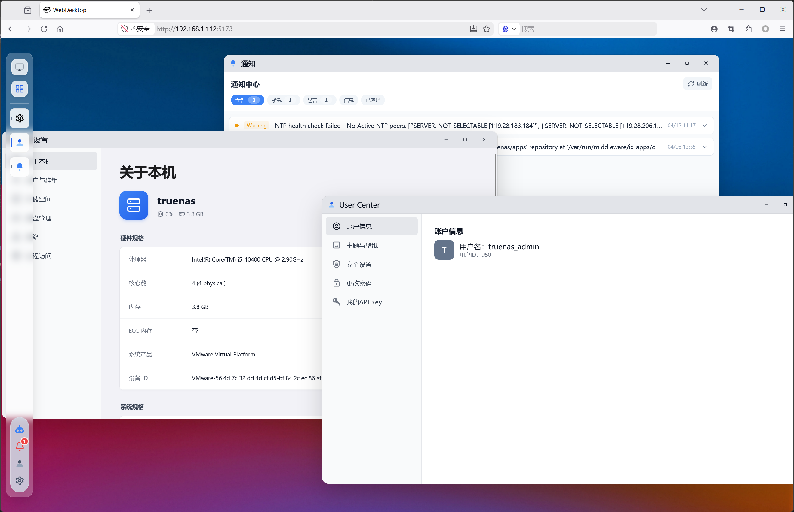

# Panda Home Station

[English](README.md)

## 项目介绍

**OpenNAS** 是一个现代化的 AI 原生家庭 NAS 系统，基于 **TrueNAS 核心技术**进行二次开发。不仅提供企业级数据存储能力，深度融合 AI 技术，为家庭用户提供智能化的数据管理与服务体验。

### TrueNAS 介绍

TrueNAS 是一款企业级开源 NAS 解决方案，具有以下优势：

- **安全性**: 基于 FreeBSD 构建，支持 SELinux，定期安全更新，在企业环境中拥有良好的安全记录
- **稳定性**: 成熟稳定，拥有 20+ 年的开发历史，广泛应用于关键任务部署
- **企业级功能**: 支持 ZFS 文件系统，提供数据完整性保护、快照、复制和高级存储管理
- **开源透明**: 完整源代码可用，透明度高，社区支持活跃
- **丰富协议**: 支持 SMB/NFS/iSCSI/AFP/SFTP 等多种协议

## OpenNAS

在 TrueNAS 核心技术基础上，OpenNAS 增强了以下核心能力：

- **AI 原生架构**：AI 能力深度融入系统核心
- **Web 桌面**：通过浏览器访问完整桌面环境，随时随地管理数据
- **企业级存储**：支持多种存储协议（ SMB/NFS/iSCSI ），提供完善的数据保护机制
- **插件系统**：模块化设计，支持通过插件扩展系统功能
- **增强交互体验**：基于 React 的现代化 WebDesktop 系统，提供更流畅的桌面级用户体验
- **中文支持**：完善的本地化支持，界面与文档全面中文化

OpenNAS 致力于为家庭用户提供一个智能、可靠、便捷的数据管理中心。



## 仓库管理

本仓库使用 Google 的 `repo` 工具来管理多个 Git 项目。

### 初始设置

1. 安装 `repo` 工具（如果尚未安装）：
   ```bash
   curl https://storage.googleapis.com/git-repo-downloads/repo > ~/.local/bin/repo
   chmod a+x ~/.local/bin/repo
   ```

2. 初始化仓库：
   ```bash
   git clone https://github.com/panda-home-station/phs.git
   cd phs
   repo init . -m repos/default.xml
   ```

3. 同步所有仓库：
   ```bash
   repo sync
   ```

## 开发指南
